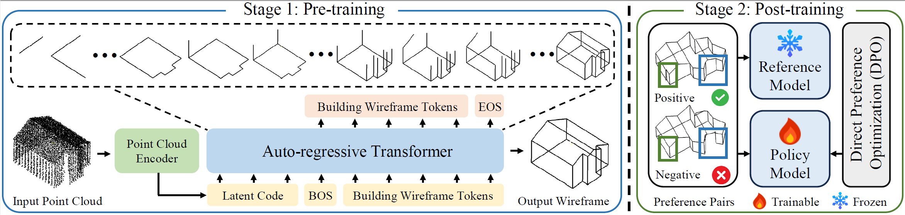

# [CVPR 2026] BuildingGPT: Auto-Regressive Building Wireframe Reconstruction Model with Reinforcement Learning
Official implementation of 'BuildingGPT: Auto-Regressive Building Wireframe Reconstruction Model with Reinforcement Learning'. 

## Abstract
In this paper, we propose BuildingGPT, a novel autoregressive
model for building wireframe reconstruction
from point clouds with reinforcement learning. Unlike
prior works based on detection or diffusion models, BuildingGPT
reformulates the building wireframe reconstruction
task into a sequence prediction problem. Based
on the hierarchical building wireframe tokenization, the
wireframe sequences are organized in a structurally- and
semantically-aware order for the next-token prediction. The
point cloud encoder first transforms the input point cloud
into a fixed-length latent code prepended before the wireframe
sequence. Then, BuildingGPT auto-regressively predicts
tokens conditioned on the latent code. After detokenization,
the building wireframe is obtained. To enhance
the model performance, we adopt a two-stage training
paradigm including the pre-training and post-training. After
the auto-regressive pre-training, Direct Preference Optimization
(DPO) is employed as a post-training strategy to
align reconstruction results with human preferences. Extensive
experiments on the large-scale MunichWF dataset
show that BuildingGPT outperforms existing state-of-theart
methods.

## Method


**Overall architecture of BuildingGPT. Our BuildingGPT is trained in two stages. In the first stage, the model is pre-trained in an
auto-regressive manner. Given the latent code encoded by the point cloud encoder, the wireframe sequence is generated through next-token
prediction. In the second stage, we construct a preference pair dataset using the proposed Preference Score Function (PSF) and post-train
the model with Direct Preference Optimization (DPO) to further enhance reconstruction quality.**

## Environment
```
git clone https://github.com/3dv-casia/BuildingGPT
cd BuildingGPT
pip install flash-attn --no-build-isolation
pip install -r requirements.txt
```

## Data
The processed dataset of MunichWF is stored in [this link]()

## Training 
```
# debug training
accelerate launch --config_file acc_configs/gpu1.yaml main.py ArAE --workspace workspace_train

# single-node training (use slurm for multi-nodes training)
accelerate launch --config_file acc_configs/gpu8.yaml main.py ArAE --workspace workspace_train
```

## Inference 
```
python infer.py ArAE --workspace workspace --resume pretrained/ArAE.safetensors --test_path data_mesh/ --generate_mode sample --test_num_face 1000 --test_repeat 1 --seed 42
```

## Citation
If you find BuildingGPT useful in your research, please cite our paper:
```
@inproceedings{liu2025BuildingGPT,
  title={BuildingGPT: Auto-Regressive Building Wireframe Reconstruction Model with Reinforcement Learning},
  author={Liu, Yuzhou and Zhu, Lingjie and Ye, Hanqiao and Liu, Yuzhun, and Huang, Shangfeng and Gao, Xiang and Wang, Ruisheng and Shen, Shuhan},
  booktitle={Proceedings of the Computer Vision and Pattern Recognition Conference},
  pages={22215--22224},
  year={2026}
}
```

## Acknowledgment
We thank the following excellent projects especially EdgeRunner:
* [EdgeRunner](https://github.com/NVlabs/EdgeRunner/tree/main)
* [transformers](https://github.com/huggingface/transformers)
